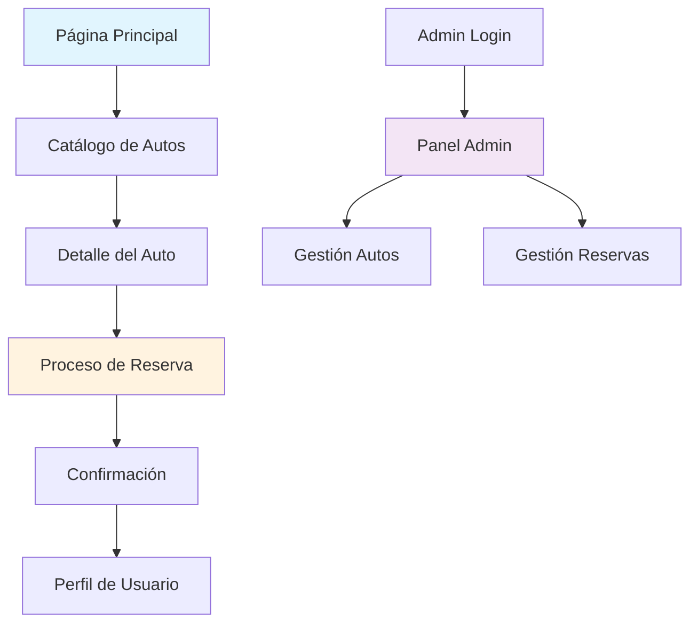

## 1. Product Overview
Plataforma de renta de autos en Paraguay diseñada como Progressive Web App (PWA) para facilitar la búsqueda y reserva de vehículos. Los usuarios pueden explorar autos disponibles, comparar precios y realizar reservas de manera rápida y accesible desde cualquier dispositivo.

- Problema: Falta de plataformas digitales locales especializadas en renta de autos
- Usuarios: Turistas, viajeros de negocios y residentes paraguayos
- Valor: Acceso inmediato a vehículos de alquiler con reservación digital sin intermediarios

## 2. Core Features

### 2.1 User Roles
| Role | Registration Method | Core Permissions |
|------|---------------------|------------------|
| Usuario Anónimo | Sin registro | Explorar autos, ver precios, filtrar búsquedas |
| Usuario Registrado | Email o Google Auth | Realizar reservas, ver historial, guardar favoritos |
| Admin | Registro manual | Gestionar flota de autos, reservas y usuarios |

### 2.2 Feature Module
La plataforma de renta de autos consta de las siguientes páginas principales:
1. **Página Principal**: Hero section con búsqueda de autos, filtros por fecha/ubicación, destacados
2. **Catálogo de Autos**: Lista de vehículos disponibles, filtros avanzados, comparación
3. **Detalle del Auto**: Información completa, galería de fotos, especificaciones, precios
4. **Proceso de Reserva**: Formulario de datos, selección de extras, pago (simulado)
5. **Perfil de Usuario**: Mis reservas, datos personales, favoritos
6. **Panel Admin**: Gestión de autos, reservas, reportes básicos

### 2.3 Page Details
| Page Name | Module Name | Feature description |
|-----------|-------------|---------------------|
| Página Principal | Hero Search | Buscar autos por fecha de recogida/devolución y ubicación. Mostrar resultados en tiempo real |
| Página Principal | Filtros Rápidos | Filtrar por tipo de auto, precio máximo, transmisión. Aplicar filtros sin recargar página |
| Catálogo de Autos | Grid de Autos | Mostrar cards con imagen, modelo, precio/día, capacidad. Scroll infinito para más resultados |
| Catálogo de Autos | Filtros Avanzados | Sidebar con filtros por marca, año, combustible, airbag, aire acondicionado. Resetear filtros |
| Detalle del Auto | Galería de Fotos | Carrusel de imágenes del auto con zoom. Mostrar interior y exterior |
| Detalle del Auto | Información Técnica | Tabla con especificaciones: motor, capacidad, consumo, maletero. Mostrar equipamiento incluido |
| Detalle del Auto | Precios y Disponibilidad | Calendario con disponibilidad, precio base por día, calcular total según días seleccionados |
| Proceso de Reserva | Datos Personales | Formulario con nombre, email, teléfono, CI/RUC. Validación en tiempo real |
| Proceso de Reserva | Extras Opcionales | Checkbox para GPS, asiento bebé, seguro adicional. Actualizar precio total dinámicamente |
| Proceso de Reserva | Confirmación | Mostrar resumen de reserva, número de confirmación, instrucciones de retiro. Enviar email |
| Perfil de Usuario | Mis Reservas | Lista de reservas activas/pasadas con estado. Cancelar reserva pendiente |
| Perfil de Usuario | Datos Personales | Editar información de contacto, cambiar contraseña. Ver historial de alquileres |
| Panel Admin | Gestión de Flota | CRUD de autos, actualizar disponibilidad, subir fotos. Ver autos más rentados |
| Panel Admin | Reservas | Ver todas las reservas, cambiar estados, generar reportes PDF. Exportar datos a Excel |

## 3. Core Process
### Flujo de Usuario Regular:
1. Usuario accede a la web → Explora catálogo → Filtra por preferencias → Selecciona auto → Verifica disponibilidad → Completa datos → Confirma reserva → Recibe confirmación

### Flujo de Administrador:
1. Admin login → Accede panel → Gestiona autos (alta/baja/modificación) → Revisa reservas → Actualiza estados → Genera reportes

## 4. User Interface Design

### 4.1 Design Style
- **Colores Primarios**: Azul Paraguay (#0038A8), Blanco (#FFFFFF)
- **Colores Secundarios**: Amardo Sol (#FCD116), Verde Esperanza (#009739)
- **Botones**: Estilo redondeado con sombra sutil, hover effects
- **Tipografía**: Inter para headers, Roboto para body text
- **Layout**: Card-based con grid responsive, navegación sticky top
- **Iconos**: Material Design Icons, emojis de autos y bandera paraguaya

### 4.2 Page Design Overview
| Page Name | Module Name | UI Elements |
|-----------|-------------|-------------|
| Página Principal | Hero Search | Background con imagen de Asunción, search bar prominente con 3 campos, botón primario verde. Cards de autos destacados en grid 3xN |
| Catálogo de Autos | Grid de Autos | Cards con imagen 16:9, badge de disponibilidad, precio en GS (guaraníes), rating estrellas. Sidebar filtros colapsable en móvil |
| Detalle del Auto | Galería de Fotos | Carrusel full-width con miniaturas, botón fullscreen. Información en tabs: Descripción, Especificaciones, Precios |
| Proceso de Reserva | Formulario Multi-step | Progress bar superior, formularios por secciones, validación visual con iconos. Resumen de costos sticky lateral |
| Panel Admin | Dashboard | Tabla con sorting y filtros, acciones en dropdown, modal para edición. Gráfico simple de reservas mensuales |

### 4.3 Responsiveness
- **Desktop-first**: Diseñado para 1440px, adaptación hacia abajo
- **Breakpoints**: 1200px, 768px, 480px
- **Mobile**: Menú hamburguesa, filtros en modal bottom sheet, cards apiladas verticalmente
- **Touch**: Swipe en galerías, botones mínimo 44px, áreas de clic ampliadas

### 4.4 PWA Features
- **Offline**: Cache de páginas vistas, catálogo básico disponible sin conexión
- **Installable**: Manifest.json con iconos Paraguay-themed, splash screen
- **Push Notifications**: Notificar confirmación de reserva, recordatorios de retorno
- **App Shell**: Header/footer consistentes, carga instantánea de navegación