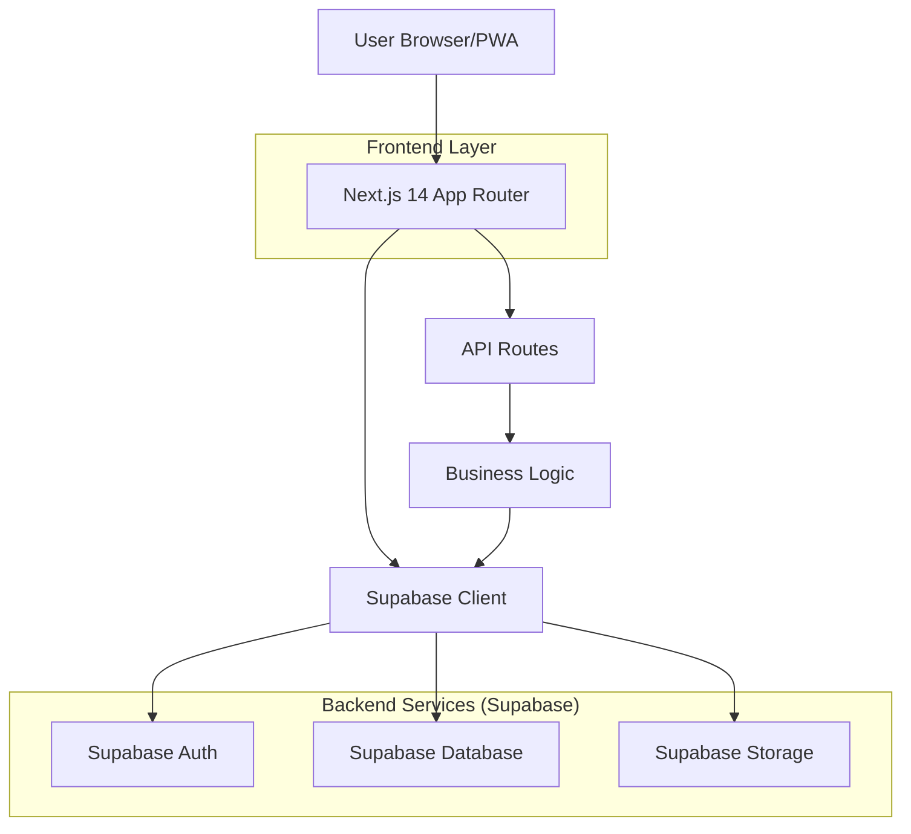
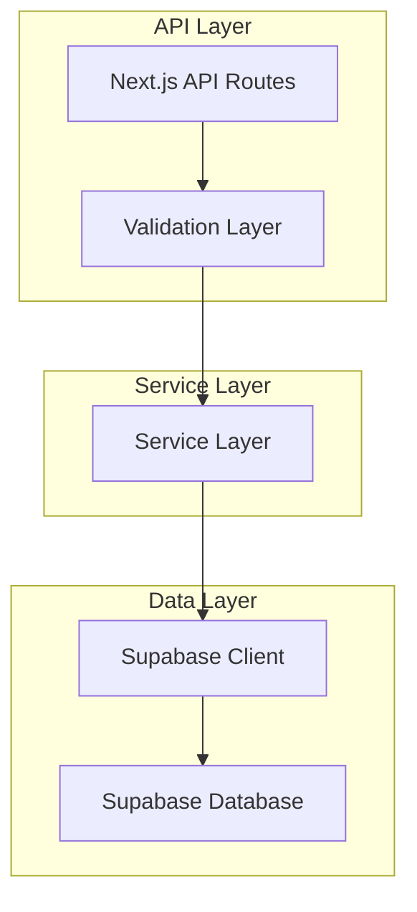
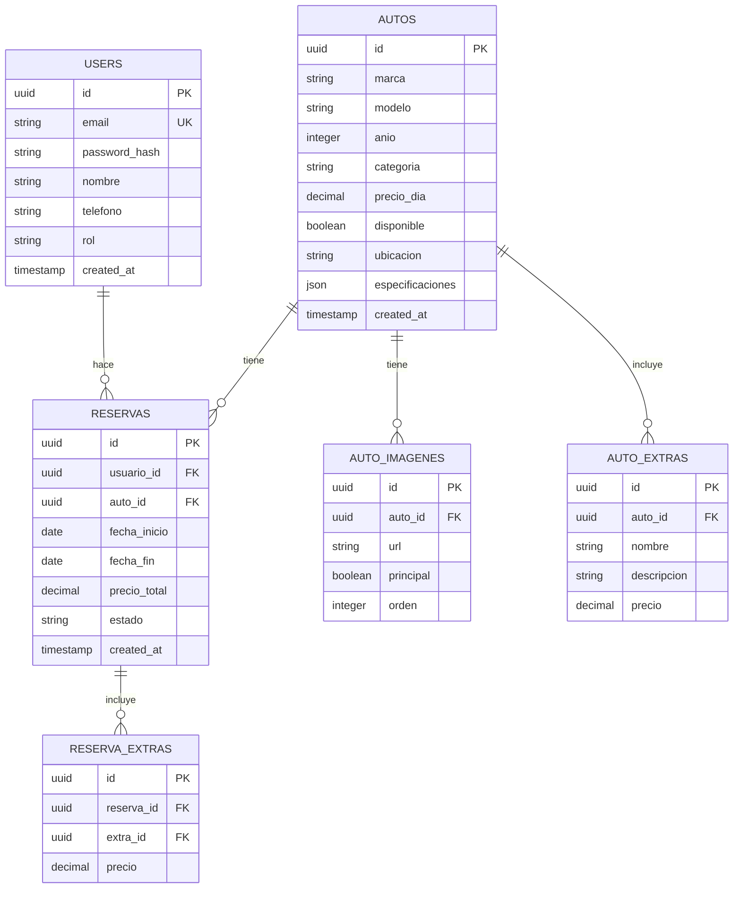

## 1. Architecture design



## 2. Technology Description

* **Frontend**: Next.js 14+ (App Router) + React 18 + TypeScript

* **Styling**: Tailwind CSS 3 + Headless UI

* **State Management**: React Context + SWR para cache

* **PWA**: next-pwa para service worker y manifest

* **Backend**: Supabase (Auth, PostgreSQL, Storage)

* **Initialization Tool**: create-next-app

## 3. Route definitions

| Route               | Purpose                                    |
| ------------------- | ------------------------------------------ |
| /                   | Página principal con búsqueda y destacados |
| /autos              | Catálogo completo con filtros              |
| /autos/\[id]        | Detalle de auto específico                 |
| /reservar/\[autoId] | Flujo de reserva multi-step                |
| /perfil             | Dashboard del usuario                      |
| /perfil/reservas    | Historial de reservas                      |
| /admin              | Panel de administración                    |
| /admin/autos        | Gestión de flota                           |
| /admin/reservas     | Gestión de reservas                        |
| /auth/login         | Página de autenticación                    |
| /auth/register      | Registro de nuevos usuarios                |

## 4. API definitions

### 4.1 Core API

**Autos - Listar disponibles**

```
GET /api/autos/disponibles
```

Request Query Params:

| Param Name    | Param Type | isRequired | Description                    |
| ------------- | ---------- | ---------- | ------------------------------ |
| fecha\_inicio | string     | true       | Fecha de recogida (ISO)        |
| fecha\_fin    | string     | true       | Fecha de devolución (ISO)      |
| ubicacion     | string     | false      | Ciudad o sucursal              |
| categoria     | string     | false      | Tipo de auto (sedan, suv, etc) |

Response:

| Param Name | Param Type | Description                |
| ---------- | ---------- | -------------------------- |
| autos      | array      | Lista de autos disponibles |
| total      | number     | Total de resultados        |

**Reservas - Crear**

```
POST /api/reservas
```

Request Body:

| Param Name    | Param Type | isRequired | Description                 |
| ------------- | ---------- | ---------- | --------------------------- |
| auto\_id      | string     | true       | ID del auto                 |
| fecha\_inicio | string     | true       | Fecha de recogida           |
| fecha\_fin    | string     | true       | Fecha de devolución         |
| usuario\_id   | string     | true       | ID del usuario              |
| extras        | array      | false      | IDs de extras seleccionados |

**Auth - Login**

```
POST /api/auth/login
```

Request:

| Param Name | Param Type | isRequired | Description       |
| ---------- | ---------- | ---------- | ----------------- |
| email      | string     | true       | Email del usuario |
| password   | string     | true       | Contraseña        |

## 5. Server architecture diagram



## 6. Data model

### 6.1 Data model definition



### 6.2 Data Definition Language

**Users Table**

```sql
CREATE TABLE users (
    id UUID PRIMARY KEY DEFAULT gen_random_uuid(),
    email VARCHAR(255) UNIQUE NOT NULL,
    password_hash VARCHAR(255) NOT NULL,
    nombre VARCHAR(100) NOT NULL,
    telefono VARCHAR(20),
    rol VARCHAR(20) DEFAULT 'user' CHECK (rol IN ('user', 'admin')),
    created_at TIMESTAMP WITH TIME ZONE DEFAULT NOW()
);

-- Indexes
CREATE INDEX idx_users_email ON users(email);
CREATE INDEX idx_users_rol ON users(rol);
```

**Autos Table**

```sql
CREATE TABLE autos (
    id UUID PRIMARY KEY DEFAULT gen_random_uuid(),
    marca VARCHAR(50) NOT NULL,
    modelo VARCHAR(50) NOT NULL,
    anio INTEGER NOT NULL,
    categoria VARCHAR(30) NOT NULL,
    precio_dia DECIMAL(10,2) NOT NULL,
    disponible BOOLEAN DEFAULT true,
    ubicacion VARCHAR(100) NOT NULL,
    especificaciones JSONB,
    created_at TIMESTAMP WITH TIME ZONE DEFAULT NOW()
);

-- Indexes
CREATE INDEX idx_autos_categoria ON autos(categoria);
CREATE INDEX idx_autos_disponible ON autos(disponible);
CREATE INDEX idx_autos_ubicacion ON autos(ubicacion);
```

**Reservas Table**

```sql
CREATE TABLE reservas (
    id UUID PRIMARY KEY DEFAULT gen_random_uuid(),
    usuario_id UUID REFERENCES users(id),
    auto_id UUID REFERENCES autos(id),
    fecha_inicio DATE NOT NULL,
    fecha_fin DATE NOT NULL,
    precio_total DECIMAL(10,2) NOT NULL,
    estado VARCHAR(20) DEFAULT 'pendiente' CHECK (estado IN ('pendiente', 'confirmada', 'cancelada', 'completada')),
    created_at TIMESTAMP WITH TIME ZONE DEFAULT NOW()
);

-- Indexes
CREATE INDEX idx_reservas_usuario ON reservas(usuario_id);
CREATE INDEX idx_reservas_auto ON reservas(auto_id);
CREATE INDEX idx_reservas_estado ON reservas(estado);
CREATE INDEX idx_reservas_fechas ON reservas(fecha_inicio, fecha_fin);
```

**Row Level Security (RLS) Policies**

```sql
-- Enable RLS
ALTER TABLE users ENABLE ROW LEVEL SECURITY;
ALTER TABLE autos ENABLE ROW LEVEL SECURITY;
ALTER TABLE reservas ENABLE ROW LEVEL SECURITY;

-- Basic policies
-- Users can only see their own data
CREATE POLICY "Users can view own profile" ON users FOR SELECT USING (auth.uid() = id);
-- Everyone can view available cars
CREATE POLICY "Anyone can view available cars" ON autos FOR SELECT USING (disponible = true);
-- Users can manage their own reservations
CREATE POLICY "Users can manage own reservations" ON reservas FOR ALL USING (auth.uid() = usuario_id);
```

## 7. PWA Configuration

**next.config.js PWA setup**

```javascript
const withPWA = require('next-pwa')({
  dest: 'public',
  register: true,
  skipWaiting: true,
  disable: process.env.NODE_ENV === 'development'
})
```

**public/manifest.json**

```json
{
  "name": "Renta Autos Paraguay",
  "short_name": "RentaAutosPY",
  "description": "Plataforma de renta de autos en Paraguay",
  "start_url": "/",
  "display": "standalone",
  "background_color": "#ffffff",
  "theme_color": "#0038A8",
  "icons": [
    {
      "src": "/icon-192x192.png",
      "sizes": "192x192",
      "type": "image/png"
    },
    {
      "src": "/icon-512x512.png",
      "sizes": "512x512",
      "type": "image/png"
    }
  ]
}
```

